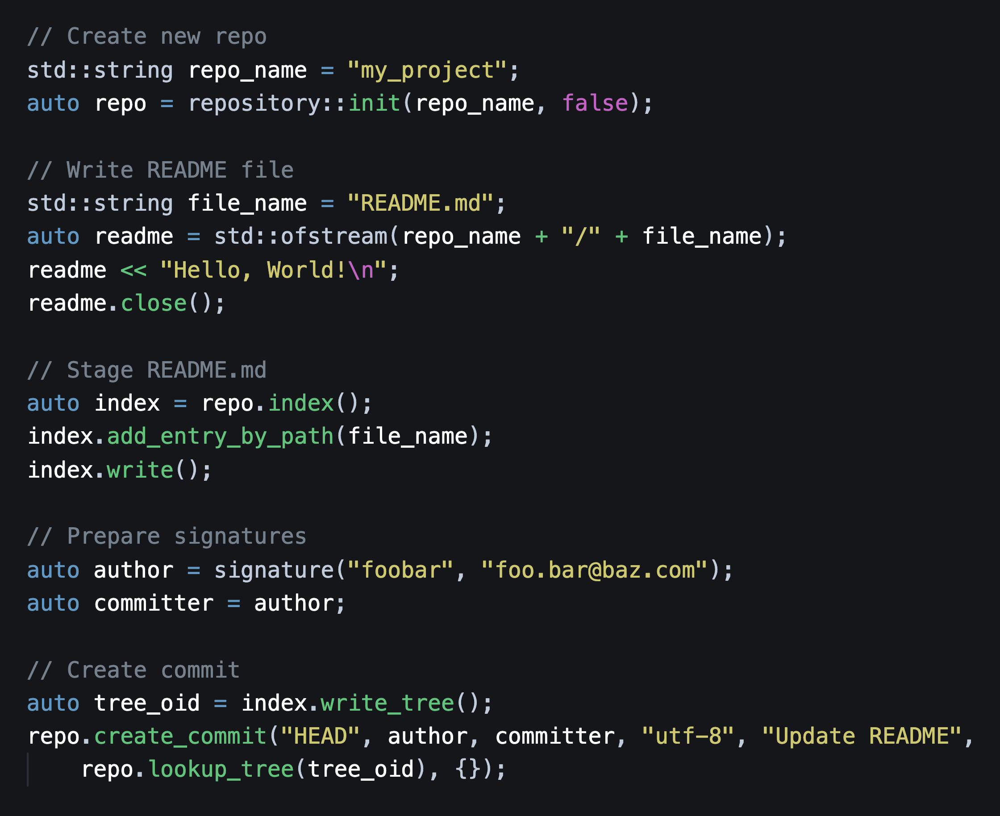

<p align="center">
    
</p>

`cppgit2` is a `libgit2` wrapper library for use in modern C++ `( >= C++11)`. See the [Build and Integration](#build-and-integration) section of details on how to build and integrate `cppgit2` in your projects.

<p align="center">
  
</p>

## Build and Integration

Run the following commands to build `cppgit2`. 

**NOTE**: This also builds `libgit2` from source. `libgit2` is a submodule in the `ext/` directory that points to a stable release commit, e.g., [v0.99.0](https://github.com/libgit2/libgit2/releases/tag/v0.99.0).

```bash
`git clone --recurse-submodules -j8 https://github.com/p-ranav/cppgit2
cd cppgit2
mkdir build && cd build
cmake .. && make
```

The build output is in three directories: `include`, `lib`, and `samples`:

```
include/
├── cppgit2/
├── git2/
└── git2.h
lib/
├── libcppgit2.so -> libcppgit2.so.1
├── libcppgit2.so.0.1.0
├── libcppgit2.so.1 -> libcppgit2.so.0.1.0
├── libcppgit2.static.a
├── libgit2_clar
├── libgit2.pc
├── libgit2.so -> libgit2.so.99
├── libgit2.so.0.99.0
├── libgit2.so.99 -> libgit2.so.0.99.0
└── ...
samples/
test/
```

For integration in your projects,

* Add `build/include` to your `include_directories`
* Add `build/lib` to your `link_directories`
* Build your application, linking with `cppgit2`
* Add `build/lib` to your `LD_LIBRARY_PATH` to load the shared libraries at runtime. 

Here's an example using `g++`:

```bash
g++ -std=c++11 -Ibuild/include -Lbuild/lib -o my_sample my_sample.cpp -lcppgit2
export LD_LIBRARY_PATH=build/lib:$LD_LIBRARY_PATH
./my_sample
```

and the same example with `CMake`:

```cmake
PROJECT(my_sample)
CMAKE_MINIMUM_REQUIRED(VERSION 3.8)

INCLUDE_DIRECTORIES("build/include")
ADD_EXECUTABLE(my_sample my_sample.cpp)
find_library(CPPGIT2_LIBRARY cppgit2 HINTS ./build/lib)
TARGET_LINK_LIBRARIES(my_sample ${CPPGIT2_LIBRARY})
SET_PROPERTY(TARGET my_sample PROPERTY CXX_STANDARD 11)
```

## API Coverage

### annotated

| libgit2 | cppgit2:: |
| --- | --- |
| `git_annotated_commit_free` | `annotated_commit::~annotated_commit` |
| `git_annotated_commit_from_fetchhead` | `repository::create_annotated_commit` |
| `git_annotated_commit_from_ref` | `repository::create_annotated_commit` |
| `git_annotated_commit_from_revspec` | `epository::create_annotated_commit` |
| `git_annotated_commit_id` | `annotated_commit::id` |
| `git_annotated_commit_lookup` | `repository::lookup_annotated_commit` |
| `git_annotated_commit_ref` | `annotated_commit::refname` |


### apply

| libgit2 | cppgit2:: |
| --- | --- |
| `git_apply` | `repository::apply_diff` |
| `git_apply_to_tree` | `repository::apply_diff` |


### attr

| libgit2 | cppgit2:: |
| --- | --- |
| `git_attr_add_macro` | `repository::add_attribute_macro` |
| `git_attr_cache_flush` | `repository::flush_attrobutes_cache` |
| `git_attr_foreach` | `repository::for_each_attribute` |
| `git_attr_get` | `repository::lookup_attribute` |
| `git_attr_get_many` | `repository::lookup_multiple_attributes` |
| `git_attr_value` | `attribute::value` |


### blame

| libgit2 | cppgit2:: |
| --- | --- |
| `git_blame_buffer` | `blame::get_blame_for_buffer` |
| `git_blame_file` | `repository::blame_file` |
| `git_blame_free` | `blame::~blame` |
| `git_blame_get_hunk_byindex` | `blame::hunk_by_index` |
| `git_blame_get_hunk_byline` |`blame::hunk_by_line` |
| `git_blame_get_hunk_count` | `blame::hunk_count` |
| `git_blame_init_options` | `blame::options::options` |
| `git_blame_options_init` | `blame::options::options` |


### blob

| libgit2 | cppgit2:: |
| --- | --- |
| `git_blob_create_from_buffer` | `repository::create_blob_from_buffer` |
| `git_blob_create_from_disk` | `repository::create_blob_from_disk` |
`git_blob_create_from_stream` | |
`git_blob_create_from_stream_commit` | |
| `git_blob_create_from_workdir` | `repository::create_blobf=_from_workdir` |
| `git_blob_create_fromworkdir` | `repository::create_blobf=_from_workdir` |
| `git_blob_dup` | `blob::copy` |
| `git_blob_filter` | **Not implemented** |
| `git_blob_filtered_content` | **Not implemented** |
| `git_blob_free` | `blob::~blob` |
| `git_blob_id` | `blob::id` |
| `git_blob_is_binary` | `blob::is_binary` |
| `git_blob_lookup` | `repository::lookup_blob` |
| `git_blob_lookup_prefix` | `repository::lookup_blob` |
| `git_blob_owner` | `blob::owner` |
| `git_blob_rawcontent` | `blob::raw_content` |
| `git_blob_rawsize` | `blob::raw_size` |


### branch

| libgit2 | cppgit2:: |
| --- | --- |
| `git_branch_create` |  `repository::create_branch` |
| `git_branch_create_from_annotated` | `repository::create_branch` |
| `git_branch_delete` | `repository::delete_branch` |
| `git_branch_is_checked_out` | `repository::is_branched_checked_out` |
| `git_branch_is_head` | `repository::is_head_pointing_to_branch` |
| `git_branch_iterator_free` | `repository::for_each_branch` |
| `git_branch_iterator_new` | `repository::for_each_branch` |
| `git_branch_lookup` | `repository::lookup_branch` |
| `git_branch_move` | `repository::rename_branch` |
| `git_branch_name` | `repository::branch_name` |
| `git_branch_next` | `repository::for_each_branch` |
| `git_branch_remote_name` | `repository::branch_remote_name` |
| `git_branch_set_upstream` | `repository::set_branch_upstream` |
| `git_branch_upstream` | `repository::branch_upstream` |
| `git_branch_upstream_name` | `repository::branch_upstream_name` |
| `git_branch_upstream_remote` | `repository::branch_upstream_remote` |


### buf

| libgit2 | cppgit2:: |
| --- | --- |
| `git_buf_contains_nul` |  `data_buffer::contains_nul` |
| `git_buf_dispose` | `data_buffer::~data_buffer` |
| `git_buf_free` | `data_buffer::~data_buffer`  |
| `git_buf_grow` | `data_buffer::grow_to_size` |
| `git_buf_is_binary` | `data_buffer::is_binary` |
| `git_buf_set` | `data_buffer::set_buffer` |

### checkout

| libgit2 | cppgit2:: |
| --- | --- |
| `git_checkout_head` | `repository::checkout_head` |
| `git_checkout_index` | `repository::checkout_index` |
| `git_checkout_options_init` | `repository::checkout::options::options` |
| `git_checkout_tree` | `repository::checkout_tree` |


### cherrypick

| libgit2 | cppgit2:: |
| --- | --- |
`git_cherrypick` | |
`git_cherrypick_commit` | |
`git_cherrypick_options_init` | |


### clone

| libgit2 | cppgit2:: |
| --- | --- |
`git_clone` | |
`git_clone_options_init` | |


### commit

| libgit2 | cppgit2:: |
| --- | --- |
| `git_commit_amend` | `commit::amend` |
| `git_commit_author` | `commit::author` |
`git_commit_author_with_mailmap` | |
| `git_commit_body` | `commit::body` |
| `git_commit_committer` | `commit::committer` |
`git_commit_committer_with_mailmap` | |
| `git_commit_create` | `repository::create_commit` |
| `git_commit_create_buffer` | `repository::create_commit` |
| `git_commit_create_v` | **Not implemented** |
| `git_commit_create_with_signature` | `repository::create_commit` |
| `git_commit_dup` | `commit::copy` |
| `git_commit_extract_signature` | `repository::extract_signature_from_commit` |
| `git_commit_free` | `commit::~commit` |
| `git_commit_header_field` | `commit::operator[]` |
| `git_commit_id` | `commit::id` |
| `git_commit_lookup` | `repository::lookup_commit` |
| `git_commit_lookup_prefix` | `repository::lookup_commit` |
| `git_commit_message` | `commit::message` |
| `git_commit_message_encoding` | `commit::message_encoding` |
| `git_commit_message_raw` | `commit::message_raw` |
| `git_commit_nth_gen_ancestor` | `commit::ancestor` |
| `git_commit_owner` | `commit::owner` |
| `git_commit_parent` | `commit::parent` |
| `git_commit_parent_id` | `commit::parent_id` |
| `git_commit_parentcount` | `commit::parent_count` |
| `git_commit_raw_header` | `commit::raw_header` |
| `git_commit_summary` | `commit::summary` |
| `git_commit_time` | `commit::time` |
| `git_commit_time_offset` | `commit::time_offset` |
| `git_commit_tree` | `commit::tree` |
| `git_commit_tree_id` | `commit::tree_id` |


### config

| libgit2 | cppgit2:: |
| --- | --- |
| `git_config_add_file_ondisk` | `repository::add_ondisk_config_file` |
| `git_config_backend_foreach_match` | **Not implemented** |
| `git_config_delete_entry` | `config::delete_entry` |
| `git_config_delete_multivar` | `config::delete_entry` |
| `git_config_entry_free` | `config::entry::~entry` |
| `git_config_find_global` | `config::locate_global_config` |
| `git_config_find_programdata` | `config::locate_global_config_in_programdata` |
| `git_config_find_system` | `config::locate_global_system_config` |
| `git_config_find_xdg` | `config::locate_global_xdg_compatible_config`  |
| `git_config_foreach` | `config::for_each` |
| `git_config_foreach_match` | `config::for_each` |
| `git_config_free` | `config::~config` |
| `git_config_get_bool` | `config::value_as_bool` |
| `git_config_get_entry` | `config::operator[]` |
| `git_config_get_int32` | `config::value_as_int32` |
| `git_config_get_int64` | `config::value_as_int64` |
| `git_config_get_mapped` | **Not implemented** |
| `git_config_get_multivar_foreach` | **Not implemented** |
| `git_config_get_path` | `config::path` |
| `git_config_get_string` | `config::value_as_string` |
| `git_config_get_string_buf` | `config::value_as_data_buffer` |
| `git_config_iterator_free` | `config::for_each_entry` |
| `git_config_iterator_glob_new` | **Not implemented** |
| `git_config_iterator_new` | `config::for_each_entry` |
| `git_config_lock` | `config::lock` |
| `git_config_lookup_map_value` | **Not implemented** |
| `git_config_multivar_iterator_new` | **Not implemented** |
| `git_config_new` | `config::new_config` |
| `git_config_next` | `config::for_each_entry` |
| `git_config_open_default` | `config::open_default_config`  |
| `git_config_open_global` | `config::open_global_config` |
| `git_config_open_level` | `config::open_config_at_level` |
| `git_config_open_ondisk` | **Not implemented** |
| `git_config_parse_bool` | `config::parse_as_bool` |
| `git_config_parse_int32` | `config::parse_as_int32` |
| `git_config_parse_int64` | `config::parse_as_int64` |
| `git_config_parse_path` | `config::parse_path` |
| `git_config_set_bool` | `config::insert_entry` |
| `git_config_set_int32` | `config::insert_entry` |
| `git_config_set_int64` | `config::insert_entry` |
| `git_config_set_multivar` | `config::insert_entry` |
| `git_config_set_string` | `config::insert_entry` |
| `git_config_snapshot` | `config::snapshot` |

### cred

| libgit2 | cppgit2:: |
| --- | --- |
`git_cred_default_new` | |
`git_cred_free` | |
`git_cred_get_username` | |
`git_cred_has_username` | |
`git_cred_ssh_custom_new` | |
`git_cred_ssh_interactive_new` | |
`git_cred_ssh_key_from_agent` | |
`git_cred_ssh_key_memory_new` | |
`git_cred_ssh_key_new` | |
`git_cred_username_new` | |
`git_cred_userpass` | |
`git_cred_userpass_plaintext_new` | |

### describe

| libgit2 | cppgit2:: |
| --- | --- |
`git_describe_commit` | |
`git_describe_format` | |
`git_describe_format_options_init` | |
`git_describe_options_init` | |
`git_describe_result_free` | |
`git_describe_workdir` | |

### diff

| libgit2 | cppgit2:: |
| --- | --- |
`git_diff_blob_to_buffer` | |
| `git_diff_blobs` | |
`git_diff_buffers` | |
`git_diff_commit_as_email` | |
`git_diff_find_options_init` | |
`git_diff_find_similar` | |
`git_diff_foreach` | |
`git_diff_format_email` | |
`git_diff_format_email_options_init` | |
| `git_diff_free` | |
`git_diff_from_buffer` | |
| `git_diff_get_delta` | |
`git_diff_get_stats` | |
`git_diff_index_to_index` | |
`git_diff_index_to_workdir` | |
| `git_diff_is_sorted_icase` | |
| `git_diff_merge` | |
| `git_diff_num_deltas` | |
| `git_diff_num_deltas_of_type` | |
| `git_diff_options_init` | |
`git_diff_patchid` | |
`git_diff_patchid_options_init` | |
`git_diff_print` | |
`git_diff_stats_deletions` | |
`git_diff_stats_files_changed` | |
`git_diff_stats_free` | |
`git_diff_stats_insertions` | |
`git_diff_stats_to_buf` | |
| `git_diff_status_char` | |
| `git_diff_to_buf` | |
`git_diff_tree_to_index` | |
`git_diff_tree_to_tree` | |
`git_diff_tree_to_workdir` | |
`git_diff_tree_to_workdir_with_index` | |

### error

| libgit2 | cppgit2:: |
| --- | --- |
`git_error_clear` | |
`git_error_last` | |
`git_error_set_oom` | |
`git_error_set_str` | |

### fetch

| libgit2 | cppgit2:: |
| --- | --- |
`git_fetch_options_init` | |

### filter

| libgit2 | cppgit2:: |
| --- | --- |
`git_filter_list_apply_to_blob` | |
`git_filter_list_apply_to_data` | |
`git_filter_list_apply_to_file` | |
`git_filter_list_contains` | |
`git_filter_list_free` | |
`git_filter_list_load` | |
`git_filter_list_stream_blob` | |
`git_filter_list_stream_data` | |
`git_filter_list_stream_file` | |

### giterr

| libgit2 | cppgit2:: |
| --- | --- |
`giterr_clear` | |
`giterr_last` | |
`giterr_set_oom` | |
`giterr_set_str` | |

### graph

| libgit2 | cppgit2:: |
| --- | --- |
`git_graph_ahead_behind` | |
`git_graph_descendant_of` | |

### ignore

| libgit2 | cppgit2:: |
| --- | --- |
`git_ignore_add_rule` | |
`git_ignore_clear_internal_rules` | |
`git_ignore_path_is_ignored` | |


### index

| libgit2 | cppgit2:: |
| --- | --- |
| `git_index_add` | |
| `git_index_add_all` | |
| `git_index_add_bypath` | |
| `git_index_add_from_buffer` | |
| `git_index_caps` | |
| `git_index_checksum` | |
| `git_index_clear` | |
| `git_index_conflict_add` | |
| `git_index_conflict_cleanup` | |
`git_index_conflict_get` | |
| `git_index_conflict_iterator_free` | |
| `git_index_conflict_iterator_new` | |
| `git_index_conflict_next` | |
| `git_index_conflict_remove` | |
| `git_index_entry_is_conflict` | |
| `git_index_entry_stage` | |
| `git_index_entrycount` | |
| `git_index_find` | |
| `git_index_find_prefix` | |
| `git_index_free` | |
| `git_index_get_byindex` | |
| `git_index_get_bypath` | |
| `git_index_has_conflicts` | |
| `git_index_iterator_free` | |
| `git_index_iterator_new` | |
| `git_index_iterator_next` | |
| `git_index_new` | |
`git_index_open` | |
`git_index_owner` | |
| `git_index_path` | |
| `git_index_read` | |
| `git_index_read_tree` | |
| `git_index_remove` | |
| `git_index_remove_all` | |
| `git_index_remove_bypath` | |
| `git_index_remove_directory` | |
| `git_index_set_caps` | |
| `git_index_set_version` | |
| `git_index_update_all` | |
| `git_index_version` | |
| `git_index_write` | |
| `git_index_write_tree` | |
| `git_index_write_tree_to` | |


### indexer

| libgit2 | cppgit2:: |
| --- | --- |
`git_indexer_append` | |
`git_indexer_commit` | |
`git_indexer_free` | |
`git_indexer_hash` | |
`git_indexer_new` | |
`git_indexer_options_init` | |


### libgit2

| libgit2 | cppgit2:: |
| --- | --- |
`git_libgit2_features` | |
| `git_libgit2_init` | |
`git_libgit2_opts` | |
| `git_libgit2_shutdown` | |
| `git_libgit2_version` | |


### merge

| libgit2 | cppgit2:: |
| --- | --- |
`git_merge` | |
`git_merge_analysis` | |
`git_merge_analysis_for_ref` | |
`git_merge_base` | |
`git_merge_base_many` | |
`git_merge_base_octopus` | |
`git_merge_bases` | |
`git_merge_bases_many` | |
`git_merge_commits` | |
`git_merge_file` | |
`git_merge_file_from_index` | |
`git_merge_file_input_init` | |
`git_merge_file_options_init` | |
`git_merge_file_result_free` | |
`git_merge_options_init` | |
`git_merge_trees` | |


### message

| libgit2 | cppgit2:: |
| --- | --- |
`git_message_prettify` | |
`git_message_trailer_array_free` | |
`git_message_trailers` | |


### note

| libgit2 | cppgit2:: |
| --- | --- |
| `git_note_author` | |
`git_note_commit_create` | |
`git_note_commit_iterator_new` | |
`git_note_commit_read` | |
`git_note_commit_remove` | |
| `git_note_committer` | |
`git_note_create` | |
`git_note_default_ref` | |
`git_note_foreach` | |
| `git_note_free` | |
| `git_note_id` | |
`git_note_iterator_free` | |
`git_note_iterator_new` | |
| `git_note_message` | |
`git_note_next` | |
`git_note_read` | |
`git_note_remove` | |


### object

| libgit2 | cppgit2:: |
| --- | --- |
| `git_object__size` | **Not implemented** |
| `git_object_dup` | |
| `git_object_free` | |
| `git_object_id` | |
| `git_object_lookup` | |
| `git_object_lookup_bypath` | |
| `git_object_lookup_prefix` | |
| `git_object_owner` | |
| `git_object_peel` | |
| `git_object_short_id` | |
| `git_object_string2type` | |
| `git_object_type` | |
| `git_object_type2string` | |
| `git_object_typeisloose` | |


### odb

| libgit2 | cppgit2:: |
| --- | --- |
`git_odb_add_alternate` | |
`git_odb_add_backend` | |
`git_odb_add_disk_alternate` | |
| `git_odb_backend_loose` | |
| `git_odb_backend_one_pack` | |
| `git_odb_backend_pack` | |
| `git_odb_exists` | |
| `git_odb_exists_prefix` | |
`git_odb_expand_ids` | |
`git_odb_foreach` | |
| `git_odb_free` | |
| `git_odb_get_backend` | |
`git_odb_hash` | |
`git_odb_hashfile` | |
| `git_odb_new` | |
| `git_odb_num_backends` | |
`git_odb_object_data` | |
`git_odb_object_dup` | |
`git_odb_object_free` | |
`git_odb_object_id` | |
`git_odb_object_size` | |
`git_odb_object_type` | |
`git_odb_open` | |
`git_odb_open_rstream` | |
`git_odb_open_wstream` | |
`git_odb_read` | |
`git_odb_read_header` | |
`git_odb_read_prefix` | |
`git_odb_refresh` | |
`git_odb_stream_finalize_write` | |
`git_odb_stream_free` | |
`git_odb_stream_read` | |
`git_odb_stream_write` | |
`git_odb_write` | |
`git_odb_write_pack` | |


### oid

| libgit2 | cppgit2:: |
| --- | --- |
| `git_oid_cmp` | |
| `git_oid_cpy` | |
| `git_oid_equal` | |
| `git_oid_fmt` | |
| `git_oid_fromraw` | |
| `git_oid_fromstr` | |
| `git_oid_fromstrn` | |
| `git_oid_fromstrp` | **Not implemented** |
| `git_oid_is_zero` | |
| `git_oid_iszero` | |
| `git_oid_ncmp` | |
| `git_oid_nfmt` | |
| `git_oid_pathfmt` | |
| `git_oid_shorten_add` | |
| `git_oid_shorten_free` | |
| `git_oid_shorten_new` | |
| `git_oid_strcmp` | |
| `git_oid_streq` | |
| `git_oid_tostr` | |
| `git_oid_tostr_s` | |


### oidarray

| libgit2 | cppgit2:: |
| --- | --- |
`git_oidarray_free` | |


### packbuilder

| libgit2 | cppgit2:: |
| --- | --- |
`git_packbuilder_foreach` | |
| `git_packbuilder_free` | |
| `git_packbuilder_hash` | |
`git_packbuilder_insert` | |
| `git_packbuilder_insert_commit` | |
| `git_packbuilder_insert_recur` | |
| `git_packbuilder_insert_tree` | |
`git_packbuilder_insert_walk` | |
`git_packbuilder_new` | |
| `git_packbuilder_object_count` | |
| `git_packbuilder_set_callbacks` | |
| `git_packbuilder_set_threads` | |
`git_packbuilder_write` | |
`git_packbuilder_write_buf` | |
| `git_packbuilder_written` | |


### patch

| libgit2 | cppgit2:: |
| --- | --- |
`git_patch_free
`git_patch_from_blob_and_buffer` | |
`git_patch_from_blobs` | |
`git_patch_from_buffers` | |
`git_patch_from_diff` | |
`git_patch_get_delta` | |
`git_patch_get_hunk` | |
`git_patch_get_line_in_hunk` | |
`git_patch_line_stats` | |
`git_patch_num_hunks` | |
`git_patch_num_lines_in_hunk` | |
`git_patch_print` | |
`git_patch_size` | |
`git_patch_to_buf` | |


### pathspec

| libgit2 | cppgit2:: |
| --- | --- |
`git_pathspec_free` | |
`git_pathspec_match_diff` | |
`git_pathspec_match_index` | |
`git_pathspec_match_list_diff_entry` | |
`git_pathspec_match_list_entry` | |
`git_pathspec_match_list_entrycount` | |
`git_pathspec_match_list_failed_entry` | |
`git_pathspec_match_list_failed_entrycount` | |
`git_pathspec_match_list_free` | |
`git_pathspec_match_tree` | |
`git_pathspec_match_workdir` | |
`git_pathspec_matches_path` | |
`git_pathspec_new` | |


### proxy

| libgit2 | cppgit2:: |
| --- | --- |
| `git_proxy_options_init` | `proxy::options::options` |

### push

| libgit2 | cppgit2:: |
| --- | --- |
| `git_push_options_init` | `push::options::options` |


### rebase

| libgit2 | cppgit2:: |
| --- | --- |
`git_rebase_abort` | |
`git_rebase_commit` | |
`git_rebase_finish` | |
`git_rebase_free` | |
`git_rebase_init` | |
`git_rebase_inmemory_index` | |
`git_rebase_next` | |
`git_rebase_onto_id` | |
`git_rebase_onto_name` | |
`git_rebase_open` | |
`git_rebase_operation_byindex` | |
`git_rebase_operation_current` | |
`git_rebase_operation_entrycount` | |
`git_rebase_options_init` | |
`git_rebase_orig_head_id` | |
`git_rebase_orig_head_name` | |


### refdb

| libgit2 | cppgit2:: |
| --- | --- |
`git_refdb_compress` | |
`git_refdb_free` | |
`git_refdb_new` | |
`git_refdb_open` | |


### reference

| libgit2 | cppgit2:: |
| --- | --- |
| `git_reference_cmp` | |
| `git_reference_create` | |
| `git_reference_create_matching` | |
| `git_reference_delete` | |
| `git_reference_dup` | |
| `git_reference_dwim` | |
| `git_reference_ensure_log` | |
| `git_reference_foreach` | |
| `git_reference_foreach_glob` | |
| `git_reference_foreach_name` | |
| `git_reference_free` | |
| `git_reference_has_log` | |
| `git_reference_is_branch` | |
| `git_reference_is_note` | |
| `git_reference_is_remote` | |
| `git_reference_is_tag` | |
| `git_reference_is_valid_name` | |
| `git_reference_iterator_free` | |
| `git_reference_iterator_glob_new` | |
| `git_reference_iterator_new` | |
| `git_reference_list` | |
| `git_reference_lookup` | |
| `git_reference_name` | |
| `git_reference_name_to_id` | |
| `git_reference_next` | |
| `git_reference_next_name` | |
| `git_reference_normalize_name` | |
| `git_reference_owner` | |
| `git_reference_peel` | |
| `git_reference_remove` | |
| `git_reference_rename` | |
| `git_reference_resolve` | |
| `git_reference_set_target` | |
| `git_reference_shorthand` | |
| `git_reference_symbolic_create` | |
| `git_reference_symbolic_create_matching` | |
| `git_reference_symbolic_set_target` | |
| `git_reference_symbolic_target` | |
| `git_reference_target` | |
| `git_reference_target_peel` | |
| `git_reference_type` | |


### reflog

| libgit2 | cppgit2:: |
| --- | --- |
| `git_reflog_append` | |
| `git_reflog_delete` | |
| `git_reflog_drop` | |
| `git_reflog_entry_byindex` | |
| `git_reflog_entry_committer` | |
| `git_reflog_entry_id_new` | |
| `git_reflog_entry_id_old` | |
| `git_reflog_entry_message` | |
| `git_reflog_entrycount` | |
| `git_reflog_free` | |
| `git_reflog_read` | |
| `git_reflog_rename` | |
| `git_reflog_write` | |


### refspec

| libgit2 | cppgit2:: |
| --- | --- |
`git_refspec_direction` | |
`git_refspec_dst` | |
`git_refspec_dst_matches` | |
`git_refspec_force` | |
`git_refspec_free` | |
`git_refspec_parse` | |
`git_refspec_rtransform` | |
`git_refspec_src` | |
`git_refspec_src_matches` | |
`git_refspec_string` | |
`git_refspec_transform` | |


### remote

| libgit2 | cppgit2:: |
| --- | --- |
`git_remote_add_fetch` | |
`git_remote_add_push` | |
`git_remote_autotag` | |
`git_remote_connect` | |
`git_remote_connected` | |
`git_remote_create` | |
`git_remote_create_anonymous` | |
`git_remote_create_detached` | |
`git_remote_create_options_init` | |
`git_remote_create_with_fetchspec` | |
`git_remote_create_with_opts` | |
`git_remote_default_branch` | |
`git_remote_delete` | |
`git_remote_disconnect` | |
`git_remote_download` | |
`git_remote_dup` | |
`git_remote_fetch` | |
`git_remote_free` | |
`git_remote_get_fetch_refspecs` | |
`git_remote_get_push_refspecs` | |
`git_remote_get_refspec` | |
`git_remote_init_callbacks` | |
`git_remote_is_valid_name` | |
`git_remote_list` | |
`git_remote_lookup` | |
`git_remote_ls` | |
`git_remote_name` | |
`git_remote_owner` | |
`git_remote_prune` | |
`git_remote_prune_refs` | |
`git_remote_push` | |
`git_remote_pushurl` | |
`git_remote_refspec_count` | |
`git_remote_rename` | |
`git_remote_set_autotag` | |
`git_remote_set_pushurl` | |
`git_remote_set_url` | |
`git_remote_stats` | |
`git_remote_stop` | |
`git_remote_update_tips` | |
`git_remote_upload` | |
`git_remote_url` | |


### repository

| libgit2 | cppgit2:: |
| --- | --- |
| `git_repository_commondir` | |
| `git_repository_config` | |
| `git_repository_config_snapshot` | |
| `git_repository_detach_head` | |
| `git_repository_discover` | |
`git_repository_fetchhead_foreach` | |
| `git_repository_free` | |
| `git_repository_get_namespace` | |
| `git_repository_hashfile` | |
| `git_repository_head` | |
| `git_repository_head_detached` | |
| `git_repository_head_detached_for_worktree` | |
| `git_repository_head_for_worktree` | |
| `git_repository_head_unborn` | |
| `git_repository_ident` | |
| `git_repository_index` | |
| `git_repository_init` | |
`git_repository_init_ext` | |
`git_repository_init_options_init` | |
| `git_repository_is_bare` | |
| `git_repository_is_empty` | |
| `git_repository_is_shallow` | |
| `git_repository_is_worktree` | |
| `git_repository_item_path` | |
`git_repository_mergehead_foreach` | |
| `git_repository_message` | |
| `git_repository_message_remove` | |
`git_repository_odb` | |
| `git_repository_open` | |
| `git_repository_open_bare` | |
`git_repository_open_ext` | |
`git_repository_open_from_worktree` | |
| `git_repository_path` | |
`git_repository_refdb` | |
| `git_repository_set_head` | |
| `git_repository_set_head_detached` | |
`git_repository_set_head_detached_from_annotated` | |
| `git_repository_set_ident` | |
| `git_repository_set_namespace` | |
| `git_repository_set_workdir` | |
| `git_repository_state` | |
| `git_repository_state_cleanup` | |
| `git_repository_workdir` | |
`git_repository_wrap_odb` | |


### reset

| libgit2 | cppgit2:: |
| --- | --- |
| `git_reset` | |
| `git_reset_default` | |
| `git_reset_from_annotated` | |


### revert

| libgit2 | cppgit2:: |
| --- | --- |
`git_revert` | |
`git_revert_commit` | |
`git_revert_options_init` | |


### revparse

| libgit2 | cppgit2:: |
| --- | --- |
`git_revparse` | |
`git_revparse_ext` | |
`git_revparse_single` | |


### revwalk

| libgit2 | cppgit2:: |
| --- | --- |
`git_revwalk_add_hide_cb` | |
`git_revwalk_free` | |
`git_revwalk_hide` | |
`git_revwalk_hide_glob` | |
`git_revwalk_hide_head` | |
`git_revwalk_hide_ref` | |
`git_revwalk_new` | |
`git_revwalk_next` | |
`git_revwalk_push` | |
`git_revwalk_push_glob` | |
`git_revwalk_push_head` | |
`git_revwalk_push_range` | |
`git_revwalk_push_ref` | |
`git_revwalk_repository` | |
`git_revwalk_reset` | |
`git_revwalk_simplify_first_parent` | |
`git_revwalk_sorting` | |


### signature

| libgit2 | cppgit2:: |
| --- | --- |
| `git_signature_default` | |
| `git_signature_dup` | |
| `git_signature_free` | |
| `git_signature_from_buffer` | |
| `git_signature_new` | |
| `git_signature_now` | |


### stash

| libgit2 | cppgit2:: |
| --- | --- |
| `git_stash_apply` | |
| `git_stash_apply_options_init` | |
| `git_stash_drop` | |
| `git_stash_foreach` | |
| `git_stash_pop` | |
| `git_stash_save` | |


### status

| libgit2 | cppgit2:: |
| --- | --- |
| `git_status_byindex` | |
| `git_status_file` | |
| `git_status_foreach` | |
| `git_status_foreach_ext` | |
| `git_status_list_entrycount` | |
| `git_status_list_free` | |
| `git_status_list_new` | |
| `git_status_options_init` | |
| `git_status_should_ignore` | |


### strarray

| libgit2 | cppgit2:: |
| --- | --- |
| `git_strarray_copy` | |
| `git_strarray_free` | |


### submodule

| libgit2 | cppgit2:: |
| --- | --- |
| `git_submodule_add_finalize` | |
`git_submodule_add_setup` | |
| `git_submodule_add_to_index` | |
| `git_submodule_branch` | |
`git_submodule_clone` | |
| `git_submodule_fetch_recurse_submodules` | |
`git_submodule_foreach` | |
| `git_submodule_free` | |
| `git_submodule_head_id` | |
| `git_submodule_ignore` | |
| `git_submodule_index_id` | |
| `git_submodule_init` | |
`git_submodule_location` | |
`git_submodule_lookup` | |
| `git_submodule_name` | |
`git_submodule_open` | |
`git_submodule_owner` | |
| `git_submodule_path` | |
| `git_submodule_reload` | |
`git_submodule_repo_init` | |
`git_submodule_resolve_url` | |
`git_submodule_set_branch` | |
`git_submodule_set_fetch_recurse_submodules` | |
`git_submodule_set_ignore` | |
`git_submodule_set_update` | |
`git_submodule_set_url` | |
`git_submodule_status` | |
| `git_submodule_sync` | |
`git_submodule_update` | |
`git_submodule_update_options_init` | |
| `git_submodule_update_strategy` | |
| `git_submodule_url` | |
| `git_submodule_wd_id` | **Not implemented** |

### tag

| libgit2 | cppgit2:: |
| --- | --- |
| `git_tag_annotation_create` | |
| `git_tag_create` | |
| `git_tag_create_from_buffer` | |
| `git_tag_create_lightweight` | |
| `git_tag_delete` | |
| `git_tag_dup` | |
| `git_tag_foreach` | |
| `git_tag_free` | |
| `git_tag_id` | |
| `git_tag_list` | |
| `git_tag_list_match` | |
| `git_tag_lookup` | |
| `git_tag_lookup_prefix` | |
| `git_tag_message` | |
| `git_tag_name` | |
| `git_tag_owner` | |
| `git_tag_peel` | |
| `git_tag_tagger` | |
| `git_tag_target` | |
| `git_tag_target_id` | |
| `git_tag_target_type` | |

### trace

| libgit2 | cppgit2:: |
| --- | --- |
| `git_trace_set` | **Not implemented** |

### transaction

| libgit2 | cppgit2:: |
| --- | --- |
| `git_transaction_commit` | |
| `git_transaction_free` | |
| `git_transaction_lock_ref` | |
| `git_transaction_new` | |
| `git_transaction_remove` | |
| `git_transaction_set_reflog` | |
| `git_transaction_set_symbolic_target` | |
| `git_transaction_set_target` | |

### tree

| libgit2 | cppgit2:: |
| --- | --- |
| `git_tree_create_updated` | |
| `git_tree_dup` | |
| `git_tree_entry_byid` | |
| `git_tree_entry_byindex` | |
| `git_tree_entry_byname` | |
| `git_tree_entry_bypath` | |
| `git_tree_entry_cmp` | |
| `git_tree_entry_dup` | |
| `git_tree_entry_filemode` | |
| `git_tree_entry_filemode_raw` | |
| `git_tree_entry_free` | |
| `git_tree_entry_id` | |
| `git_tree_entry_name` | |
| `git_tree_entry_to_object` | |
| `git_tree_entry_type` | |
| `git_tree_entrycount` | |
| `git_tree_free` | |
| `git_tree_id` | |
| `git_tree_lookup` | |
| `git_tree_lookup_prefix` | |
| `git_tree_owner` | |
| `git_tree_walk` | |


### treebuilder

| libgit2 | cppgit2:: |
| --- | --- |
| `git_treebuilder_clear` | |
| `git_treebuilder_entrycount` | |
| `git_treebuilder_filter` | |
| `git_treebuilder_free` | |
| `git_treebuilder_get` | |
| `git_treebuilder_insert` | |
| `git_treebuilder_new` | |
| `git_treebuilder_remove` | |
| `git_treebuilder_write` | |
| `git_treebuilder_write_with_buffer` | |

### worktree

| libgit2 | cppgit2:: |
| --- | --- |
`git_worktree_add` | |
`git_worktree_add_options_init` | |
| `git_worktree_free` | |
| `git_worktree_is_locked` | |
| `git_worktree_is_prunable` | |
`git_worktree_list` | |
| `git_worktree_lock` | |
`git_worktree_lookup` | |
| `git_worktree_name` | |
`git_worktree_open_from_repository` | |
| `git_worktree_path` | |
| `git_worktree_prune` | |
| `git_worktree_prune_options_init` | |
| `git_worktree_unlock` | |
| `git_worktree_validate` | |

